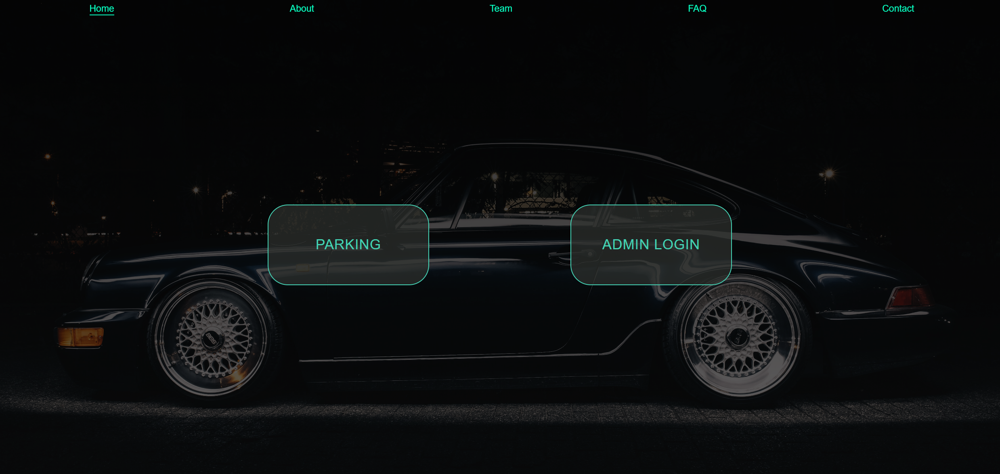
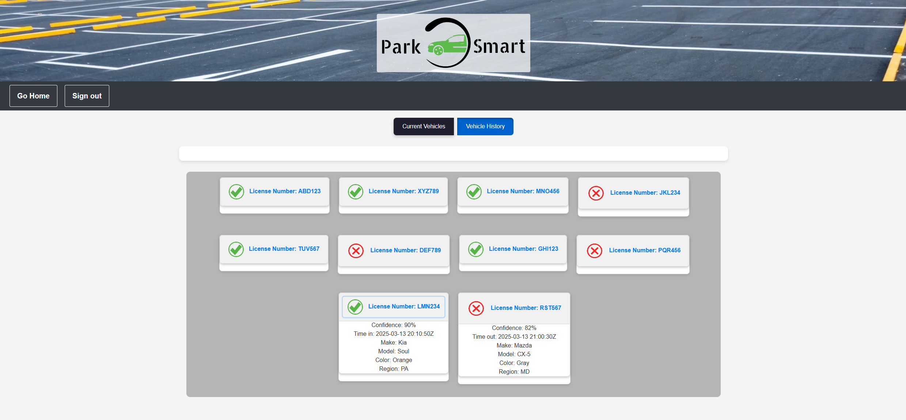
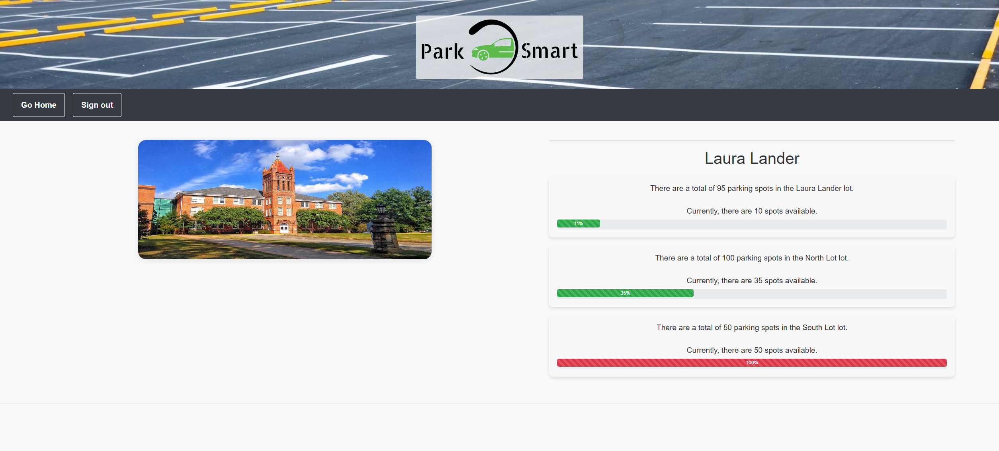

# ParkSmart

## Overview
ParkSmart is a smart parking management system developed as a senior college project at Lander University. It won the biennial competition at Lander University due to its innovative approach to tracking parking lot usage and enforcing parking regulations.

The system was designed to assist both Lander University Police Department (LUPD) and students in managing parking. It uses an Arduino-based sensor system to detect vehicles entering parking lots, captures their images, and processes the data to determine vehicle details such as make, model, color, and license plate number.

## How It Works
1. **Vehicle Detection**: An Arduino with pressure-sensitive sensors detects a car entering a parking lot and triggers a camera to capture an image.
2. **Data Processing**: The image is sent to [Plate Recognizer](https://platerecognizer.com) API, which extracts details like the vehicle’s make, model, color, and license plate number.
3. **Database Storage**: This information is stored in a database for further reference.
4. **Frontend Display**: The frontend fetches data from the database and serves it to different users:
   - **Students**: Can check real-time parking availability.
   - **LUPD Officers**: Can verify if a vehicle is parked legally by checking if its license plate is registered. Currently, parking enforcement relied on an honor system, but with this technology, officers can quickly identify unauthorized vehicles with faster precision.

## Installation & Running the Project
### Prerequisites
- **Node.js v14** (Ensure you're using Node.js 14 to avoid compatibility issues)
- **npm (Node Package Manager)**

### Setup Instructions
1. Clone the repository:
   ```sh
   git clone https://github.com/your-repo/ParkSmart.git
   ```
2. Navigate to the frontend client directory:
   ```sh
   cd ParkSmart-main/frontend/Client
   ```
3. Install dependencies:
   ```sh
   npm install
   ```
4. Start the application:
   ```sh
   npm start
   ```

## Mock Data Usage
The frontend currently runs using mock data instead of a live backend. This allows for testing the UI without requiring database connectivity, due to the previous Arduino and database requirement.

## Technologies Used
- **Frontend**: React.js
- **Backend**: Node.js, Express (API)
- **Database**: MongoDB (for vehicle storage)
- **Hardware**: Arduino with pressure sensors & camera module
- **Vehicle Recognition API**: [Plate Recognizer](https://platerecognizer.com)

## Environment Variables
Ensure you have a `.env` file in `frontend/Client` for Firebase or other configurations:
```plaintext
REACT_APP_FIREBASE_KEY=your-api-key
REACT_APP_FIREBASE_DOMAIN=your-auth-domain
REACT_APP_FIREBASE_DATABASE=your-database-url
REACT_APP_FIREBASE_PROJECT_ID=your-project-id
REACT_APP_FIREBASE_STORAGE_BUCKET=your-storage-bucket
REACT_APP_FIREBASE_SENDER_ID=your-sender-id
REACT_APP_FIREBASE_APP_ID=your-app-id
```
## Achievements
- 🏆 **Won the biennial competition at Lander University**
- 🚗 **Innovative use of Arduino and API-based vehicle recognition**
- 📊 **Improved campus parking management & enforcement**

---
🚀 **Developed by a passionate team at Lander University**
**Previously hosted at www.LanderParking.com**








